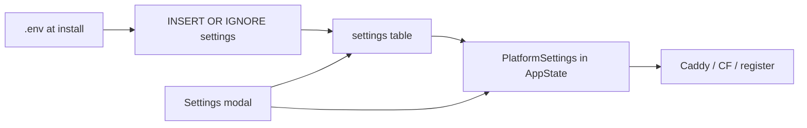

# Platform Domain & Settings Truth

DB-backed platform domain / dashboard Settings with a confirmed domain-change job; tryout via sslip.io; production still expects a real domain.

**Status:** Core implementation landed (orchestrator resolver + domain job APIs, Settings UI, install tryout path, docs). This doc preserves product decisions and follow-ups for later pickup.

---

## Problem (historical)

Settings could edit Platform Domain / Dashboard Subdomain / DNS Target, but live routing used `state.config` from `.env`. Domain/dashboard saves were effectively no-ops. Requiring a purchased domain before first try added friction.

---

## Product stance (locked)

- **Production:** Real domain (or subdomain as `DOMAIN`). Not an IP:port PaaS.
- **Tryout:** Install may set `DOMAIN={public_ip_dashed}.sslip.io` (e.g. `203.0.113.5` → `203-0-113-5.sslip.io`). **Full LiteBin** — dashboard, app deploys, agents. LE may fail; user accepts (banner). No deploy block.
- **Agents on tryout:** Yes. Master pushes the same sslip `DOMAIN` via `/internal/register`. Under **master_proxy**, public traffic still hits master (`{project}.{DOMAIN}` → master IP); agents do not need their own sslip names.
- **Upgrade path:** Settings platform-domain change (preflight + progress job).
- **Master proxy DNS:** `*.{DOMAIN}` → LiteBin; **specific records override wildcards** (`mail.` / `app.` elsewhere OK). Apex ≠ wildcard. Or `DOMAIN=apps.example.com` + `*.apps.example.com`.
- **Cloudflare DNS:** `DOMAIN` may be a subdomain of the CF zone; sync only LiteBin-owned names under the platform DOMAIN suffix.
- **Tryout + Cloudflare:** Not supported — tryout forces `master_proxy` (sslip zone is not user-controlled).
- **Out of scope (still):** Branded `nip.l8b.in` at scale, bare-IP dashboard.
- **Domain expiry lockout:** CLI/install `set-domain` (e.g. back to sslip) — **follow-up**.

### Tryout detection

Domain ending in `.sslip.io` / `.nip.io` ⇒ Settings banner (“tryout DNS — not for production; LE may fail”). No functional lock.

---

## Source of truth

| Field | Seed | Runtime | UI |
|---|---|---|---|
| `domain` | `.env` once | DB + in-memory | Heavy change flow |
| `dashboard_subdomain` | `.env` once | DB + in-memory | Simple save + sync |
| `poke_subdomain` | `.env` once | DB + in-memory | No UI |
| `dns_target` | empty / user | DB | Display-only field |
| `routing_mode`, CF token/zone | existing | DB (startup reads DB) | Existing |
| Infra (`PORT`, certs, `DATABASE_URL`, …) | `.env` | env forever | none |

**Module:** [`orchestrator/src/platform.rs`](../../orchestrator/src/platform.rs) — `PlatformHandle` / `PlatformSettings` / domain job types.

---

## Defaults (locked)

- **Preflight:** Cloudflare mode hard-fails if zone does not cover the new domain or token cannot manage records. Master-proxy: DNS resolve mismatch is a **warning**; user must ack DNS before apply.
- **After apply:** Show new dashboard URL; re-login on new host required. No automatic rollback to old domain.
- **Cloudflare cleanup on apply:** Delete LiteBin-managed A records under `*.{oldDomain}`, then sync under new domain.
- **Poke:** No Settings UI.
- **dns_target:** Display-only DB field (no sync side effects).

---

## Implemented surface

### Backend APIs

| Method | Path | Role |
|---|---|---|
| `GET` | `/settings` | Includes live domain + `tryout` flag |
| `PATCH` | `/settings` | Rejects `domain`; dashboard subdomain → sync routes + re-register agents |
| `POST` | `/settings/domain/preflight` | `{ domain }` → `{ ok, errors[], warnings[] }` |
| `POST` | `/settings/domain/apply` | `{ domain, acknowledge_dns }` → `{ job_id }` |
| `GET` | `/settings/domain/jobs/{id}` | Poll steps |
| `POST` | `/settings/domain/jobs/{id}/retry` | Resume from failed step |

**Apply steps:** persist → rebuild master routes → re-register agents → push agent Caddy → CF cleanup+sync (or skip) → done.

### Frontend

[`dashboard/src/components/GlobalSettingsModal.tsx`](../../dashboard/src/components/GlobalSettingsModal.tsx) — domain read-only + Change modal (confirm type-to-confirm, preflight, progress, retry). Tryout banner. Save does not send domain.

### Install tryout

[`install.sh`](../../install.sh) master prompts:

1. Detect public IP.
2. “Domain or subdomain ready?”
   - **Yes** → domain prompt + dashboard/poke + routing/CF.
   - **No** → `DOMAIN={ip-dashed}.sslip.io`, force `master_proxy`, skip CF prompts, tryout warning.

### Key call sites (prefer `state.platform.*` over `config.domain`)

- `orchestrator/src/routes/global_settings.rs`
- `orchestrator/src/routing_helpers.rs`
- `orchestrator/src/routes/nodes.rs` (`reregister_online_agents`)
- `orchestrator/src/nodes/heartbeat.rs`
- deploy / waker / caddy / janitor / reconciliation / activity

---

## Follow-ups (pick up later)

1. **CLI / install `set-domain`** — recover from domain expiry lockout (e.g. fall back to sslip) without dashboard access.
2. **Branded nip / `nip.l8b.in`** — out of scope; LE quota risk on shared parent domain.
3. **Bare-IP dashboard** — explicitly rejected for now.
4. **Hardening tests** — preflight / apply / dashboard subdomain sync; tryout install → deploy + agent register; sslip → real domain migration; CF sync must not delete unrelated `mail.` records.
5. **Persist domain jobs** — currently in-memory `DashMap`; restart loses in-flight job status (domain value in DB remains).

---

## Test plan (manual / future automation)

- [ ] Preflight rejects same domain / bad format; CF zone mismatch errors; master-proxy resolve warnings.
- [ ] Domain apply progress + retry from failed step.
- [ ] Dashboard subdomain PATCH updates Caddy + agent register.
- [ ] Tryout install → DB `domain` = `{dashed-ip}.sslip.io`; deploy web project; agent gets sslip domain; master_proxy wake works.
- [ ] Domain apply sslip → real domain; old URLs die; new work; re-login.
- [ ] CF: sync/cleanup only under platform DOMAIN suffix.

---

## Related docs

- [configuration.md](../configuration.md) — env seed vs DB
- [api-reference.md](../api-reference.md) — settings + domain endpoints
- [CHANGELOG.md](../../CHANGELOG.md) — Unreleased bullets
- README DNS / tryout section
